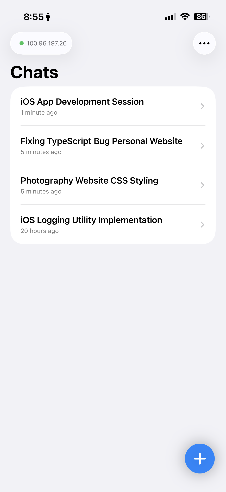
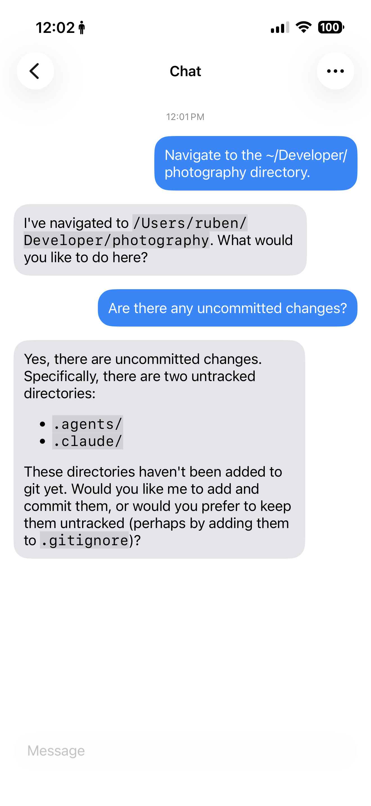
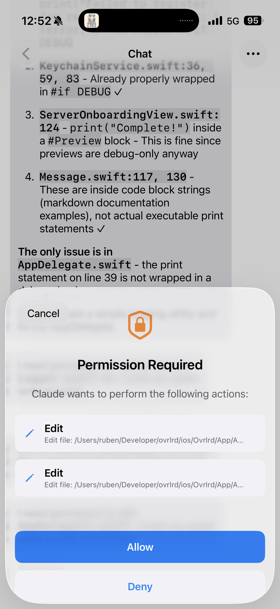
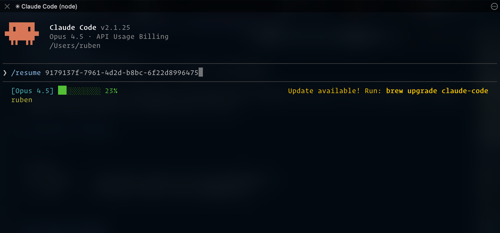
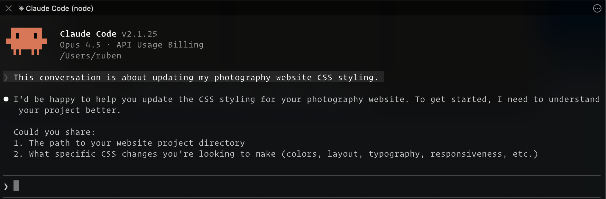
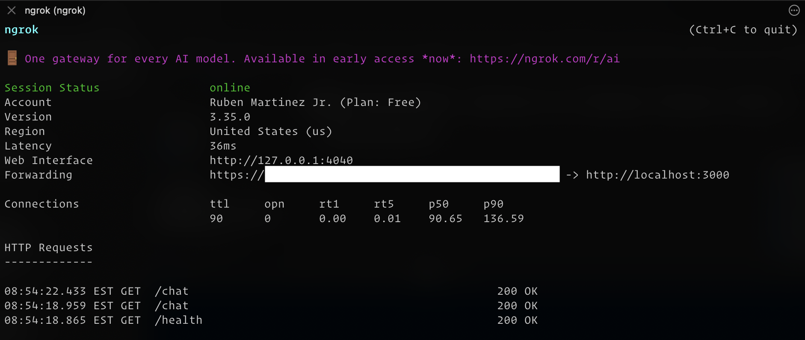

# Ovrlrd

A native iOS interface for Claude CLI that preserves the full power of Claude Code—tools, skills, session memory, and MCP servers—accessible from your phone.

<table width="100%">
    <thead>
        <tr>
            <td>Chats</td>
            <td>Conversation</td>
            <td>Permissions</td>
        </tr>
    </thead>
    <tbody>
        <tr>
            <td width="33%"></td>
            <td width="33%"></td>
            <td width="33%"></td>
        </tr>
    </tbody>
</table>

## Why

Claude CLI is powerful. It can read files, run commands, use tools, maintain conversation context across sessions, and integrate with MCP servers. But it's tied to your terminal. Without non-intuitive remote access software, it's not easy to access on-the-go.

Ovrlrd bridges that gap. It's not a simplified mobile chatbot—it's a direct line to your Claude CLI instance running on your local machine. When you send a message from your phone, it reaches the same Claude session that has access to your filesystem, your tools, and your project context.

## How It Works

```
┌─────────────────┐                    ┌─────────────────┐                    ┌─────────────────┐
│   iOS Client    │  ◄───────────────► │  Local Server   │ ◄───────────────►  │   Claude CLI    │
│   (SwiftUI)     │       HTTP/S       │   (Bun/Hono)    │     subprocess     │   (session-id)  │
└─────────────────┘                    └─────────────────┘                    └─────────────────┘
```

### The Server

A lightweight Bun/Hono server that:

- **Manages Claude CLI sessions**: Each conversation maps to a persistent Claude session via `--resume`. Your conversation history, tool approvals, and context carry across messages.
- **Streams responses**: Uses Claude CLI's streaming JSON output to deliver responses token-by-token via Server-Sent Events.
- **Handles authentication**: Apple Sign In with an allowlist of approved users/devices. Your Claude instance, your rules.
- **Stores conversations**: SQLite database for messages and conversation metadata. The actual Claude context lives in Claude's session files.
- **Basic security**: API key authentication, rate limiting, request validation, CORS configuration, and audit logging.

### The iOS App

A lightweight native SwiftUI app that:

- **Renders Claude's responses**: Full markdown support including code blocks, tables, and formatting.
- **Handles tool permissions**: When Claude wants to run a command or access a file, you see the same permission prompt you'd see in the terminal—approve or deny from your phone.
- **Manages conversations**: Create, browse, pin, and delete conversations. Titles auto-generate from the first message.
- **Streams in real-time**: Watch Claude think and respond, just like in the terminal.

## What You Get

- **Full Claude CLI capabilities from mobile**: Tools, skills, MCP servers, file access—everything Claude CLI can do.
- **Persistent sessions**: Resume conversations exactly where you left off, with full context.
- **Permission control**: Approve or deny tool usage on a per-request basis.
- **Private by design**: Runs on your machine, your network. To open it up for remote access, use the tools you already have setup (ngrok, Cloudflare, Tailscale, etc.).
- **Pick up where you left off**: Since sessions exist on your computer, you can use `/resume <session-id>` to continue a conversation where you left off.




Session IDs can be copied from the Chat UI.

## Architecture

The key insight is that we don't try to recreate Claude's capabilities—we just proxy to Claude CLI. This means:

1. **No capability drift**: As Claude CLI gains new features, Ovrlrd gets them automatically.
2. **Full context**: Claude sees your actual files, can run actual commands, uses your actual MCP servers.
3. **Session continuity**: The `--resume` flag preserves everything across messages.

The server acts as a thin translation layer:

- Converts HTTP requests to CLI invocations
- Parses streaming JSON output into SSE events
- Maps permission requests to a mobile-friendly approval flow

### Streaming & Tool Use

Responses stream via Server-Sent Events. When Claude uses tools mid-response, the text naturally splits into separate messages:

1. Claude sends text: "Let me check that file..."
2. Server sends `segment_end` → first message is finalized
3. Server sends `tool_start` → client shows "working" indicator with tool name
4. Tool executes
5. Server sends `tool_end`
6. Claude resumes with new text → becomes a new message

This creates a natural conversation flow where each thought and action is its own message, avoiding awkward spacing when text resumes after tool use

## Project Structure

```
ovrlrd/
├── server/    # Bun/Hono backend (see server/README.md)
└── ios/       # SwiftUI client (see ios/README.md)
```

## Getting Started

### Prerequisites

**Required tools:**

```bash
# Claude CLI
npm install -g @anthropic-ai/claude-cli
claude login

# Bun runtime
curl -fsSL https://bun.sh/install | bash

# XcodeGen (for iOS)
brew install xcodegen
```

**Also required:**

- macOS (for running the server and Xcode)
- Xcode 16+ (for iOS development)
- Apple Developer account (for running on device - Sign In with Apple requires it)

### Server Setup

```bash
cd server
bun install
cp .env.example .env
```

Edit `.env` with your settings:

```bash
# Required - generate with: openssl rand -base64 32
JWT_SECRET=your-random-secret
API_KEY=your-api-key

# User allowlist
APPROVED_EMAILS=you@example.com
```

Start the server:

```bash
bun run dev
```

### iOS Setup

```bash
cd ios
cp Config/Local.xcconfig.example Config/Local.xcconfig
```

Edit `Config/Local.xcconfig` with your Apple Developer Team ID:

```
DEVELOPMENT_TEAM = YOUR_TEAM_ID
```

Generate and open the project:

```bash
xcodegen generate
open Ovrlrd.xcodeproj
```

Build and run on a physical device (Sign In with Apple requires it).

On first launch, the app will prompt you to enter your server URL and API key—no rebuild required when these change.

### Local Development

To run the full stack locally:

1. **Start the server:**

   ```bash
   cd server && bun run dev
   ```

2. **Build and run the iOS app** to simulator or a physical device

3. **Enter your server URL** in the app's onboarding screen (e.g., `http://127.0.0.1:3000`)

If your server URL changes, just update it in the app's settings (tap the server indicator in the toolbar)—no rebuild needed.

### Enabling Remote Access

To access your server from outside your local network, expose it via the tool of your choice:

**1. ngrok** (easiest)

```bash
brew install ngrok
ngrok config add-authtoken <token>
ngrok http 3000
```

ngrok provides HTTPS automatically, which is required for Sign in with Apple.



**2. Cloudflare Tunnels**

Similar to ngrok but free for unlimited use. Requires a Cloudflare account and domain.

**3. Tailscale / ZeroTier**

Private mesh VPN between your devices. More secure (not publicly exposed) but requires the VPN client on your phone and computer. Note: Sign in with Apple requires HTTPS—you'd need to set up TLS yourself via mkcert + Caddy, or disable Apple Sign In.

#### Security Considerations

When exposing your server remotely:

- **API key**: Always set a strong `API_KEY` in `.env`—this is your first line of defense
- **User allowlist**: Configure `APPROVED_EMAILS` or `APPROVED_APPLE_IDS` to restrict who can authenticate
- **CORS**: Optionally set `CORS_ORIGINS` to restrict cross-origin requests
